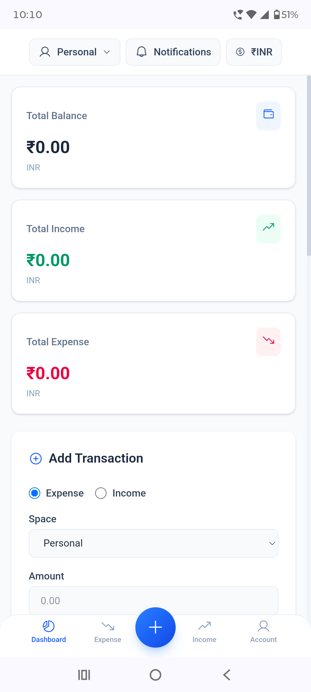
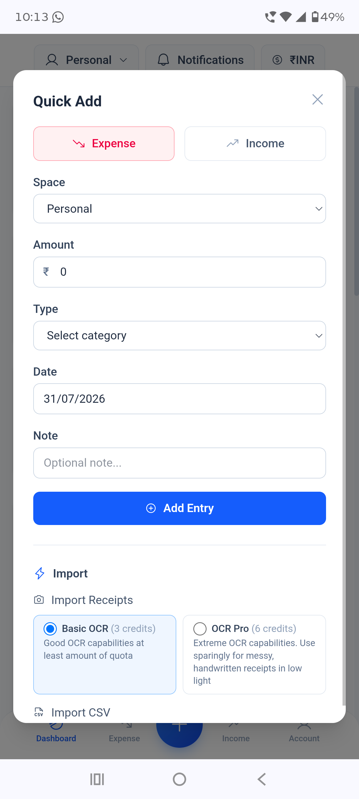

# SpendsWise

[](https://github.com/coder11125/SpendsWise/actions/workflows/ci.yml) [](https://github.com/coder11125/SpendsWise/blob/main/LICENSE) [](https://svelte.dev) [](https://www.typescriptlang.org) [](https://github.com/coder11125/SpendsWise/commits/main)

A personal finance tracker built with Svelte 5, TypeScript, Express, and MongoDB. Includes shared multi-user Spaces, an AI finance assistant powered by Groq, real-time sync via Pusher, recurring transactions, receipt OCR, weekly AI-narrated summaries, and multi-currency support. Deployed on Vercel.

## Features

### Dashboard
A comprehensive overview featuring summary cards (total balance, income, expenses, net), an interactive category pie chart, a trend line chart showing spending patterns over time, budget progress bars with color-coded thresholds (green → amber → red), a list of upcoming recurring transactions, and your most recent transaction entries.


### Transactions
Add, edit, and delete income and expense entries with rich metadata including category, date, currency, and optional notes. Each entry supports custom categories, per-transaction currency selection, and flexible date picking with flatpickr for a smooth UX.


### Spaces (Hubs)
Share a ledger with other accounts. Each Hub is a genuinely separate MongoDB database (see [Spaces](#spaces-hubs) below), invited by email, with per-member nicknames shown on every shared entry, chart, and summary. Up to 3 Hubs may exist across the whole app.


### Recurring Transactions
Set up templates with daily, weekly, biweekly, monthly, or yearly frequency. Entries are automatically generated by a server-side scheduler running every 60 seconds, working seamlessly in both your personal ledger and every Hub you belong to. Each recurring transaction can have an optional end date.

### AI Assistant
Chat with your financial data through a natural language interface powered by Groq. The AI can query your transactions, provide insights, and even perform actions like adding, editing, or deleting transactions on your behalf via structured tool calls. Includes receipt OCR capabilities for both single images and bulk uploads (up to 10 images), with a standard mode and an optional higher-accuracy "OCR Pro" mode for challenging receipts.


### Weekly Summaries
AI-narrated recaps generated for each completed week, summarizing your income, expenses, net position, top spending categories, and week-over-week changes. Summaries are generated lazily on first request and then cached per user, with fallbacks to numeric data when AI services are unavailable.


### Budget Goals
Set per-category spending limits with visual progress tracking. Each budget bar transitions through green (under budget), amber (approaching limit), and red (over budget) states, providing immediate visual feedback on your spending habits.

### Multi-Currency Support
Support for 150+ currencies with live exchange rate fetching via exchangerate-api.com. Each transaction can have its own currency, while a unified display currency allows you to view all amounts in your preferred currency. Conversion rates are cached and automatically refresh.


### Import / Export
Bulk data management with CSV import supporting up to 500 rows per file, and full CSV export of your transaction data. The import system intelligently maps columns and handles various date formats.

### Real-Time Sync
Instant updates across all your devices via Pusher WebSocket events. When WebSockets are unavailable, the system gracefully falls back to 5-minute polling intervals. Real-time updates work for both personal transactions and Hub activity, with per-user and per-Hub Pusher channels.

### Notifications
Non-intrusive notification system where pending Hub invites appear in the Header dropdown instead of disruptive popups. Notifications are delivered in real-time via Pusher and include accept/decline actions that can be taken directly from the notification panel.

### Signed Balances
Accurate financial tracking where the Total Balance is calculated as income minus expenses. This means expense-only ledgers or periods where you've spent more than you've earned will correctly display a negative balance, providing a true picture of your financial state.

### Dark Mode
System-aware dark mode that automatically switches based on your OS preference. The toggle state is persisted to `localStorage` and can be manually overridden, with a smooth color transition across the entire application.

### Mobile-First Design
Fully responsive layout with a dedicated mobile navigation experience. On mobile devices, a bottom navigation bar provides quick access to Dashboard, Expense, a floating Quick Add button, Income, and Account views. The bottom nav features a concave center cutout with a raised gradient Quick Add button for one-tap transaction entry. On desktop, a collapsible sidebar provides the same navigation.

<div align="center">
  
  
</div>

### Authentication
Flexible authentication system supporting traditional email/password registration and login, plus Google OAuth for convenience. Passwords are securely hashed with bcrypt (cost 12), and session management uses HttpOnly cookies with CSRF protection.

## Spaces (Hubs)

A Space ("Hub") is a shared ledger between two or more existing accounts — e.g. a household budget. Key properties:

- **Isolated storage.** Each Hub gets its own MongoDB database (`space_<id>`), created on demand via `mongoose.connection.useDb()` on the same connection/cluster as everything else. Deleting a Hub drops that database outright.
- **Invite by email, accept required.** A Hub owner looks up an existing account by email and assigns them a nickname; the invite sits as `pending` until the invitee accepts or declines it from the Header's Notifications dropdown. Invite changes are delivered through the user's Pusher channel.
- **Shared, trust-based ledger.** Any active member can add, edit, or delete any entry in a Hub. Entries are stamped with the contributing member's id, and their nickname is shown on the row, in exports, and in a per-member breakdown chart alongside the usual category charts.
- **Global cap of 3.** Once 3 Hubs exist anywhere in the app, no more can be created.
- **Personal data is untouched.** Your own ledger stays exactly as it was — Hubs are an additional, optional context you switch into via the Header dropdown or the **Spaces** view, or by picking one straight from the "Space" selector on the add-transaction forms.
- **Destructive Hub deletion.** Deleting a Hub drops its isolated MongoDB database and all transactions in it. Hub records are never migrated into Personal, and the client clears the previous ledger before loading the new context.

Manage Hubs (create, rename, invite, rename a member's nickname, remove a member, delete a Hub) from the **Spaces** view in the sidebar.

## Project layout

```
SpendsWise/
├── index.html                  # Vite frontend entry
├── src/                        # Svelte 5 SPA
│   ├── app.ts                  # Client entry point
│   ├── App.svelte              # Root component — router, modals, layout
│   ├── app.css                 # Tailwind v4 via @import "tailwindcss"
│   ├── types.ts                # Shared TypeScript interfaces
│   ├── lib/
│   │   ├── state.svelte.ts     # Reactive state (Svelte 5 runes) incl. active Space context
│   │   ├── api.ts              # API wrapper + all endpoint functions (context-aware for Spaces)
│   │   ├── currency.ts         # Currency formatting/conversion + live rates
│   │   ├── calculations.svelte.ts  # Async summary/category/member-breakdown calculations
│   │   ├── utils.ts            # Date helpers, trend data, image compression
│   │   ├── charts.ts           # Canvas pie chart + trend chart renderers
│   │   └── constants.ts        # Currencies, colors, category icons
│   ├── components/             # UI components (modals, forms, cards, charts, SpacesView pieces)
│   └── views/                  # Dashboard, IncomeView, ExpenseView, AccountView, SpacesView, SummariesView
├── api/
│   └── index.ts                # Vercel serverless entry (re-exports Express app)
├── server/                     # Express + TypeScript API
│   └── src/
│       ├── app.ts              # Express app setup — middleware, routes, scheduler
│       ├── index.ts            # Local dev entry (listens on PORT)
│       ├── config.ts           # Environment variable loading
│       ├── db.ts               # MongoDB connection (main database)
│       ├── lib/
│       │   ├── pusher.ts       # Pusher real-time notifications (per-user and per-Hub channels)
│       │   ├── recurringScheduler.ts  # 60s scheduler — personal ledger + every Hub's ledger
│       │   ├── spaceDb.ts      # Per-Hub database/model resolution via useDb()
│       │   ├── expenseHandlers.ts  # Shared CRUD route logic for personal + Hub ledgers
│       │   └── timezone.ts     # IANA timezone helpers for weekly summary boundaries
│       ├── middleware/         # auth, csrf, asyncHandler, groqRateLimiter, passport, spaceScope
│       ├── models/             # Expense, User, Space, SpaceExpense, Summary Mongoose schemas
│       └── routes/             # auth, expenses, spaces, spaceExpenses, ai, currency, summaries
├── vercel.json
├── package.json                # Frontend deps + scripts
└── server/package.json         # Backend deps + scripts
```

## Getting started

### Prerequisites

- Node.js 18+
- A MongoDB instance (local or [MongoDB Atlas](https://www.mongodb.com/atlas)) — the database user needs write access to **any** database on the cluster (not just one named database), since each Space creates its own on demand

### 1. Frontend

```bash
npm install
npm run dev        # Vite dev server with HMR (proxies /api → localhost:4000)
npm run build      # production build → dist/
npm run preview    # preview production build locally
```

### 2. Backend

```bash
cd server
npm install
cp .env.example .env
# Fill in the required values (see Environment variables below)
npm run dev        # tsx watch, auto-reload on change
```

Generate secrets:

```bash
node -e "console.log(require('crypto').randomBytes(48).toString('base64url'))"
```

Health check: `GET http://localhost:4000/health`

## Environment variables

Set these in `server/.env` for local development, or in your Vercel dashboard for production.

| Variable | Required | Description |
|----------|----------|-------------|
| `MONGODB_URI` | yes | MongoDB connection string |
| `JWT_SECRET` | yes | Long random string for signing JWTs |
| `CSRF_SECRET` | yes | Long random string for signing CSRF tokens (separate from `JWT_SECRET`) |
| `PORT` | no | Local dev server port (default: 4000) |
| `ALLOWED_ORIGINS` | no | Comma-separated CORS allow-list (default: `https://spends-wise.vercel.app`); Vercel preview URLs are added automatically |
| `GOOGLE_CLIENT_ID` | no | Google OAuth — from Google Cloud Console → APIs & Services → Credentials |
| `GOOGLE_CLIENT_SECRET` | no | Google OAuth client secret |
| `GOOGLE_CALLBACK_URL` | no | Default: `http://localhost:5173/api/auth/google/callback` |
| `FRONTEND_URL` | no | Default: `http://localhost:5173` (must match Vite dev server or Vercel URL) |
| `CRON_SECRET` | recommended | Secret for the scheduler endpoint `/api/cron/recurring`. Set the **same** value in Vercel env vars and as a GitHub Actions repository secret (`.github/workflows/recurring-cron.yml`). Vercel sends it automatically as the Authorization header on cron invocations. |
| `GROQ_API_KEY` | no | Enables AI features — get one free at [console.groq.com](https://console.groq.com) |
| `GROQ_MODEL` | no | Groq text model for chat/summaries (default: `llama-3.3-70b-versatile`) |
| `GROQ_VISION_API_KEY` | no | Separate Groq key for receipt OCR — falls back to `GROQ_API_KEY` |
| `GROQ_VISION_MODEL` | no | Groq vision model for standard receipt OCR (default: `meta-llama/llama-4-scout-17b-16e-instruct`) |
| `GROQ_VISION_PRO_MODEL` | no | Groq vision model for "OCR Pro" mode (default: `qwen/qwen3.6-27b`) |
| `AI_WEEKLY_LIMIT` | no | Max AI requests per user per week, resets Monday server-local time (default: 115) |
| `OCR_PRO_COST` | no | AI-quota cost per OCR Pro receipt scan, vs. 3 for standard OCR (default: 6) |
| `PUSHER_APP_ID` | no | Pusher app ID — enables real-time sync |
| `PUSHER_KEY` | no | Pusher public key (used by server and client) |
| `PUSHER_SECRET` | no | Pusher secret (server only) |
| `PUSHER_CLUSTER` | no | Pusher cluster, e.g. `us2`, `eu`, `ap1` (default: `ap1`) |
| `CURRENCY_API_KEY` | no | [exchangerate-api.com](https://app.exchangerate-api.com/sign-up) key — **required for real conversion**; without it all rates silently fall back to 1:1 (surfaced to the user as "not live") |

Omitting `PUSHER_*` falls back to 5-minute polling only. Omitting `GROQ_API_KEY` disables all `/api/ai/*` endpoints (they respond 503) — everything else works normally.

## API

**Recurring transactions scheduler** (no browser client calls this):

- `GET /api/cron/recurring` — runs the global recurring scan (personal ledgers + every Hub). Requires `Authorization: Bearer <CRON_SECRET>`. Invoked by Vercel cron (`vercel.json`, every 5 min on Pro / daily on Hobby) and by the GitHub Actions `Recurring Cron` workflow (`*/15 * * * *`). Safe to call concurrently — each template is claimed atomically.
- **Lazy catch-up**: `GET /api/expenses` and `GET /api/spaces/:spaceId/expenses` also generate any due recurring entries for that user/Hub before returning, so recurring transactions always appear the moment someone opens the app, even if the cron was delayed or the free tier only allows one run per day.

Session is managed via an HttpOnly cookie (`sw_session`). All state-changing requests must include a valid CSRF token in the `x-csrf-token` header — fetch one from `GET /api/auth/csrf` first.

| Method | Path | Auth | Description |
|--------|------|------|-------------|
| GET | `/health` | no | Health check |
| GET | `/api/auth/csrf` | no | Get CSRF token; sets `sw_csrf` cookie |
| POST | `/api/auth/register` | no | `{ email, password }` |
| POST | `/api/auth/login` | no | `{ email, password }` |
| POST | `/api/auth/logout` | no | Clears session cookie |
| GET | `/api/auth/me` | yes | Current user profile |
| PUT | `/api/auth/password` | yes | `{ currentPassword, newPassword }` |
| PUT | `/api/auth/timezone` | yes | `{ timezone }` — IANA zone name, used for weekly summary boundaries |
| GET | `/api/auth/google` | no | Start Google OAuth flow |
| GET | `/api/auth/google/callback` | no | Google OAuth callback |
| GET | `/api/expenses` | yes | List all personal expenses (sorted by date desc) |
| POST | `/api/expenses` | yes | `{ amount, category, type, note?, date?, currency?, familyMember?, recurrence? }` |
| PUT | `/api/expenses/:id` | yes | Update any subset of expense fields |
| DELETE | `/api/expenses/:id` | yes | Delete single expense |
| DELETE | `/api/expenses` | yes | `{ confirm: true }` — delete all personal expenses |
| GET | `/api/expenses/recurring` | yes | List active personal recurring templates |
| PUT | `/api/expenses/:id/recurring` | yes | `{ frequency, endDate, isActive, nextDueDate }` |
| POST | `/api/expenses/bulk` | yes | `{ rows: [...] }` — bulk create up to 500 rows |
| GET | `/api/spaces` | yes | List Hubs you're an active member of |
| GET | `/api/spaces/invites` | yes | List Hubs where you have a pending invite |
| POST | `/api/spaces` | yes | `{ name }` — create a Hub (rejected once 3 exist app-wide) |
| PATCH | `/api/spaces/:id` | owner | `{ name }` — rename a Hub |
| DELETE | `/api/spaces/:id` | owner | `{ confirm: true }` — delete a Hub and drop its database |
| POST | `/api/spaces/:id/members` | owner | `{ email, nickname }` — invite an existing account (pending until accepted) |
| PATCH | `/api/spaces/:id/members/:userId` | self or owner | `{ nickname }` — rename a member |
| DELETE | `/api/spaces/:id/members/:userId` | self or owner | Remove a member, or leave the Hub |
| POST | `/api/spaces/:id/invites/respond` | invitee | `{ accept: boolean }` — accept or decline a pending invite |
| GET/POST/PUT/DELETE | `/api/spaces/:spaceId/expenses/...` | active member | Same CRUD/recurring/bulk shape as `/api/expenses`, scoped to that Hub's own database; entries are attributed to the acting member instead of `familyMember` |
| GET | `/api/currency/rates` | yes | `?base={currency}` — live conversion rates |
| GET | `/api/currency/convert` | yes | `?from=&to=&amount=` — convert a single amount |
| GET | `/api/summaries` | yes | Weekly AI-narrated summaries (generates the latest completed week's on first request) |
| GET | `/api/ai/quota` | yes | Remaining weekly AI quota |
| POST | `/api/ai/chat` | yes | `{ message, history? }` — chat with expense context; can add/edit/delete transactions via tool calls |
| POST | `/api/ai/parse-receipt` | yes | `{ imageData, pro? }` — base64 receipt image → expense fields |
| POST | `/api/ai/parse-receipts-bulk` | yes | `{ images: [...], pro? }` — batch OCR, up to 10 images |

## Data model

**Expense** (main database — your personal ledger)

```
{
  userId: ObjectId,
  type: "income" | "expense",
  amount: Number (0–1e12),
  category: String,
  currency: String (default "USD"),
  familyMember: String,             // legacy free-text tag; superseded by Spaces
  note: String,
  date: Date,
  recurrence: {                    // null for non-recurring
    frequency: "daily" | "weekly" | "biweekly" | "monthly" | "yearly",
    nextDueDate: Date,
    endDate: Date | null,
    isActive: Boolean
  },
  timestamps: true
}
```

Recurring templates carry the `recurrence` subdocument. Auto-generated instances are plain expenses with no `recurrence` field.

**User** (main database)

```
{
  email: String (unique),
  passwordHash: String,
  googleId: String (optional),
  timezone: String,                 // IANA zone, used for weekly summary boundaries
  aiUsage: { count, weeklyCount, weekStartDate },
  tokenVersion: Number,
  timestamps: true
}
```

**Space** (main database — one document per Hub)

```
{
  name: String,
  ownerId: ObjectId,
  members: [{
    userId: ObjectId,
    nickname: String,
    role: "owner" | "member",
    status: "pending" | "active",
    invitedAt: Date,
    joinedAt: Date | null
  }],
  timestamps: true
}
```

**SpaceExpense** (one per Hub, in that Hub's own `space_<id>` database)

Same shape as `Expense`, but `authorUserId` (the contributing member) in place of `userId`/`familyMember`.

**Summary** (main database — one per user per week)

```
{
  userId: ObjectId,
  weekStartDate: String,  // Monday, YYYY-MM-DD, unique per user
  weekEndDate: String,
  timezone: String,
  narrative: String,      // AI-generated recap, or a numeric fallback if Groq is unavailable
  stats: { totalIncome, totalExpense, net, transactionCount, byCategory, previousWeekExpense },
  timestamps: true
}
```

## Testing

Tests run in CI on every push and pull request (`test-client` and `test-server` jobs).

| Suite | Location | Command |
|---|---|---|
| Client unit tests | `src/**/*.test.ts` | `npm test` (Vitest + jsdom) |
| Server integration tests | `server/test/**/*.test.ts` | `cd server && npm test` (Vitest + Supertest + in-memory MongoDB) |

Server tests use `mongodb-memory-server` — no local MongoDB or credentials are required. The binary is pinned to MongoDB 6.0.19 (7.x x64 builds require AVX2) and cached locally in `server/.mongodb-binaries`. Coverage spans auth (register/login/password change/session revocation), CSRF, the expense CRUD factory (validation, scoping, mass-assignment protection, ETags, bulk limits), the recurring scheduler's atomic claim behavior under concurrent runs, the full Express app end to end, and client currency/summary/trend/chart logic. See `CONTRIBUTING.md` for the pre-commit checklist.

## Security

| Control | Detail |
|---------|--------|
| CSRF protection | Double-submit cookie pattern. `GET /api/auth/csrf` issues a token; all POST/PUT/PATCH/DELETE must send it as `x-csrf-token`. |
| Session cookie | HttpOnly, SameSite=Strict, Secure (production). |
| Token revocation | `tokenVersion` on the User document. Password change increments it, invalidating all live sessions instantly. |
| Rate limiting | Auth: 10 req / 15 min / IP. Expenses & Spaces: 200 req / 15 min / IP. AI: burst + sliding-window + concurrency limits per user and per Groq key. |
| Content-Type enforcement | Non-JSON bodies on state-changing requests rejected with 415. |
| Password rules | 12–72 characters, requires uppercase, lowercase, digit, and special character. bcrypt cost 12. |
| NoSQL injection | `express-mongo-sanitize` strips `$` and `.` operator keys from all request bodies. |
| Security headers | Helmet (HSTS, X-Content-Type-Options, etc.) on every response. |
| ObjectId validation | All `:id` params validated with `ObjectId.isValid()` before DB queries. |
| Google OAuth isolation | Email and Google ID lookups run separately to prevent account takeover. |
| Space isolation | `spaceScope` middleware requires an **active** membership record before granting access to a Hub's database; each Hub's data lives in its own physical MongoDB database (`useDb()`), not just a filtered field. |

## Deployment (Vercel)

The project deploys as a monorepo on Vercel:

- **Frontend** — Vite builds the Svelte SPA to `dist/`; static files served by Vercel CDN.
- **Backend** — `api/index.ts` is the serverless entry; all `/api/*` and `/health` requests route there.

```json
{
  "buildCommand": "npm run build",
  "outputDirectory": "dist",
  "routes": [
    { "src": "/api/(.*)", "dest": "api/index.ts" },
    { "src": "/health", "dest": "api/index.ts" },
    { "handle": "filesystem" },
    { "src": "/(.*)", "dest": "/index.html" }
  ]
}
```

> **MongoDB Atlas notes:**
> - Add `0.0.0.0/0` to Network Access so Vercel's dynamic IPs can connect.
> - The database user in `MONGODB_URI` needs write access to **any** database on the cluster (e.g. `readWriteAnyDatabase`), not just one named database — Spaces create their own database on demand via `useDb()`.

## License

MIT
